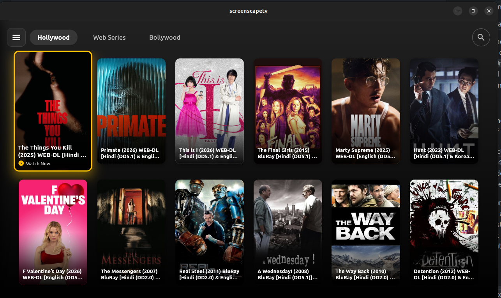
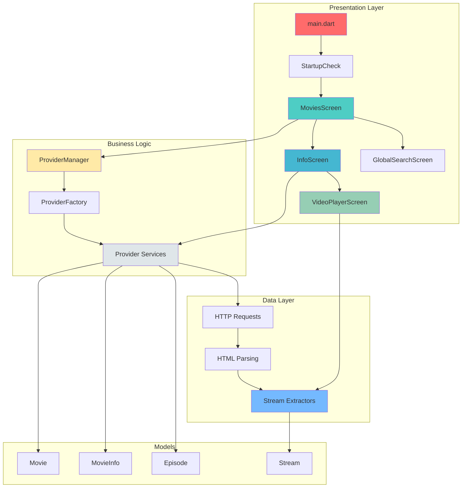
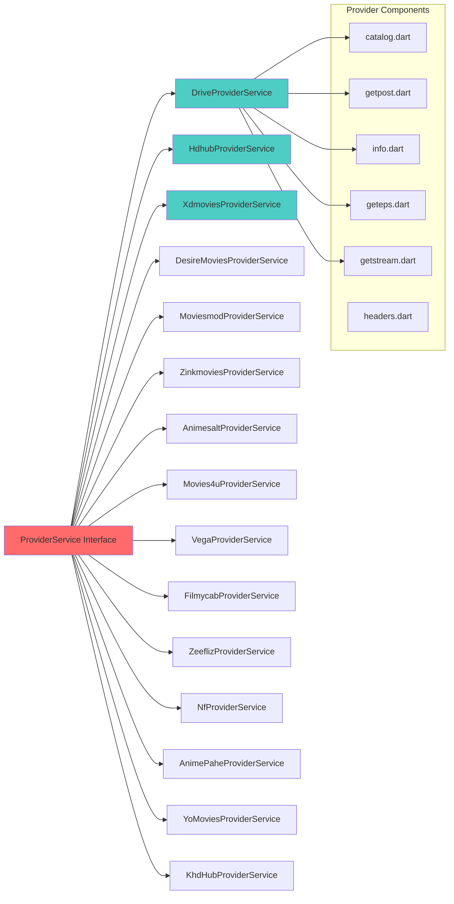
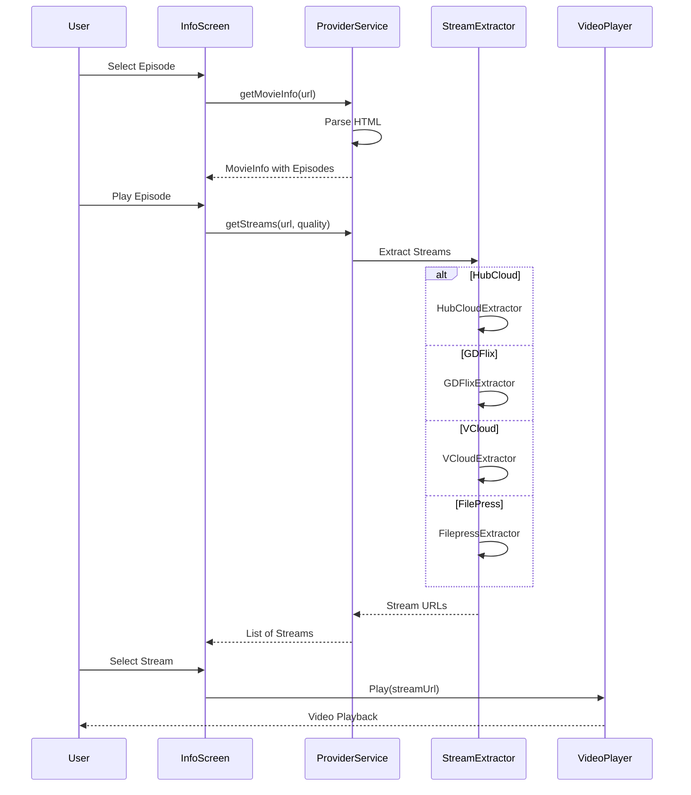

# ScreenScapeTV 📺

A multi-provider streaming application built with Flutter that aggregates content from various movie and TV show providers. This application provides a unified interface to browse, search, and stream content from multiple sources.

<div align="center">
  
</div>

## 📱 Screenshots

<div align="center">
  <table>
    <tr>
      <td align="center">
        
        <br />
        <b>Home Screen</b>
      </td>
      <td align="center">
        
        <br />
        <b>Movie/Series Info</b>
      </td>
      <td align="center">
        
        <br />
        <b>Episode Selection</b>
      </td>
    </tr>
  </table>
</div>

## ✨ Features

- **Multi-Provider Support**: Access content from 15+ streaming providers
- **Global Search**: Search across all providers simultaneously
- **Provider Switching**: Easily switch between different content providers
- **Category Browsing**: Browse content by categories (Hollywood, Bollywood, Web Series, etc.)
- **Detailed Info Pages**: View comprehensive information about movies and TV shows
- **Episode Management**: Browse and select episodes for TV series
- **Multiple Stream Quality**: Support for various quality options (480p, 720p, 1080p, etc.)
- **VLC Integration**: External VLC player support for streaming
- **Built-in Player**: Integrated video player using tha_player
- **TV-Optimized UI**: D-Pad navigation support for Android TV
- **Cross-Platform**: Available on Android, Android TV, Linux, and more

## 🏗️ Architecture

### Application Architecture



### Provider Architecture



### Stream Extraction Flow



## 📂 Project Structure

```
screenscapetv/
├── lib/
│   ├── main.dart                           # Application entry point
│   ├── libs/
│   │   └── baseurl.dart                   # Base URL management
│   ├── models/
│   │   ├── movie.dart                     # Movie model for catalog
│   │   └── movie_info.dart                # Detailed movie/episode info
│   ├── provider/
│   │   ├── provider_manager.dart          # Provider state management
│   │   ├── provider_factory.dart          # Provider instantiation
│   │   ├── provider_service.dart          # Abstract provider interface
│   │   ├── providers.dart                 # Provider data management
│   │   ├── episode_stream_extractor.dart  # Episode stream extraction
│   │   ├── extractors/                    # Stream extractors
│   │   │   ├── stream_types.dart
│   │   │   ├── hubcloud_extractor.dart
│   │   │   ├── gdflix_extractor.dart
│   │   │   ├── vcloud_extractor.dart
│   │   │   ├── filepress_extractor.dart
│   │   │   ├── gdirect_extractor.dart
│   │   │   └── gofile_extractor.dart
│   │   ├── drive/                         # Drive provider
│   │   │   ├── drive_provider_service.dart
│   │   │   ├── catalog.dart
│   │   │   ├── getpost.dart
│   │   │   ├── geteps.dart
│   │   │   ├── info.dart
│   │   │   └── index.dart
│   │   ├── hdhub/                         # Hdhub4u provider
│   │   │   ├── hdhub_provider_service.dart
│   │   │   ├── catalog.dart
│   │   │   ├── getpost.dart
│   │   │   ├── info.dart
│   │   │   ├── getstream.dart
│   │   │   ├── get_redirect_links.dart
│   │   │   ├── headers.dart
│   │   │   └── index.dart
│   │   ├── xdmovies/                      # Xdmovies provider
│   │   ├── desiremovies/                  # DesireMovies provider
│   │   ├── moviesmod/                     # Moviesmod provider
│   │   │   └── tech_extractor.dart        # Custom tech extractor
│   │   ├── zinkmovies/                    # ZinkMovies provider
│   │   ├── animesalt/                     # AnimeSalt provider
│   │   ├── movies4u/                      # Movies4u provider
│   │   ├── vega/                          # VegaMovies provider
│   │   ├── filmycab/                      # FilmyCab provider
│   │   ├── zeefliz/                       # Zeefliz provider
│   │   ├── nf/                            # Netflix Mirror provider
│   │   │   └── nf_get_cookie.dart         # Cookie management
│   │   ├── animepahe/                     # AnimePahe provider
│   │   ├── yomovies/                      # YoMovies provider
│   │   └── khdhub/                        # 4kHDHub provider
│   ├── screens/
│   │   ├── startup_check.dart             # Initial VLC check screen
│   │   ├── movies_screen.dart             # Main catalog screen
│   │   ├── info.dart                      # Movie/Series details
│   │   ├── global_search_screen.dart      # Multi-provider search
│   │   └── video_player_screen.dart       # Video playback
│   ├── widgets/
│   │   ├── sidebar.dart                   # Navigation sidebar
│   │   ├── seasonlist.dart                # Season selection
│   │   ├── episode_selection_dialog.dart  # Episode picker
│   │   └── streaming_links_dialog.dart    # Stream quality selector
│   └── utils/
│       ├── vlc_checker.dart               # VLC availability check
│       ├── vlc_launcher.dart              # External VLC launcher
│       └── key_event_handler.dart         # D-Pad/keyboard navigation
├── assets/                                 # Application assets
│   ├── Home.png
│   ├── INFO.png
│   └── EPS.png
├── android/                                # Android platform code
├── ios/                                    # iOS platform code
├── linux/                                  # Linux platform code
├── windows/                                # Windows platform code
├── macos/                                  # macOS platform code
├── web/                                    # Web platform code
├── debian-package/                         # Debian package files
├── pubspec.yaml                            # Project dependencies
└── analysis_options.yaml                   # Dart analyzer config
```

## 🎬 Supported Providers

| Provider | Categories | Special Features |
|----------|-----------|-----------------|
| 🎥 **Drive** | Hollywood, Bollywood, Web Series | Default provider |
| 🎬 **Hdhub4u** | Multiple categories | Redirect link handling |
| 📽️ **Xdmovies** | Movies & Series | - |
| 🎭 **DesireMovies** | Hollywood, Bollywood | - |
| 🎪 **Moviesmod** | Multiple categories | Tech extractor |
| 💿 **ZinkMovies** | Movies & Series | - |
| 🎌 **AnimeSalt** | Anime | Episode support |
| 📺 **Movies4u** | Movies & TV | - |
| 🌟 **VegaMovies** | Hollywood, Bollywood | Multiple extractors |
| 🚗 **FilmyCab** | Movies | - |
| 🎦 **Zeefliz** | Movies & Series | - |
| 📡 **Netflix Mirror** | Mirror content | Cookie management |
| 🎯 **AnimePahe** | Anime | - |
| 🎬 **YoMovies** | Movies | - |
| 🎞️ **4kHDHub** | 4K content | Redirect handling |

## 🛠️ Tech Stack

- **Framework**: Flutter 3.10.8+
- **Language**: Dart
- **UI**: Material Design (Dark Theme)
- **State Management**: ChangeNotifier (Provider Pattern)
- **HTTP Client**: http package
- **HTML Parsing**: html package
- **Video Player**: tha_player
- **External Player**: VLC (via url_launcher)
- **Wakelock**: wakelock_plus
- **Local Storage**: shared_preferences

## 📦 Key Dependencies

```yaml
dependencies:
  flutter_html: ^3.0.0          # HTML rendering
  http: ^1.2.0                  # HTTP requests
  html: ^0.15.4                 # HTML parsing
  tha_player: ^0.5.1            # Video player
  wakelock_plus: ^1.2.9         # Screen wake lock
  package_info_plus: ^8.1.1     # App info
  url_launcher: ^6.3.1          # External links/VLC
  installed_apps: ^2.1.1        # Check installed apps
  shared_preferences: ^2.5.4    # Local storage
```

## 🚀 Installation

### Prerequisites

- Flutter SDK (3.10.8 or higher)
- Dart SDK
- Android Studio / VS Code with Flutter extension
- VLC Media Player (for external playback)

### Steps

1. **Clone the repository**
   ```bash
   git clone https://github.com/yourusername/screenscapetv.git
   cd screenscapetv
   ```

2. **Install dependencies**
   ```bash
   flutter pub get
   ```

3. **Run the app**
   ```bash
   # For Android
   flutter run
   
   # For Android TV
   flutter run
   
   # For Linux
   flutter run -d linux
   
   # For Web
   flutter run -d chrome
   ```

4. **Build release APK**
   ```bash
   # Universal APK
   flutter build apk
   
   # Split per ABI (smaller file size)
   flutter build apk --split-per-abi
   ```

5. **Build for other platforms**
   ```bash
   # Linux
   flutter build linux
   
   # Windows
   flutter build windows
   
   # macOS
   flutter build macos
   ```

## 🎮 Usage

### Navigation

- **D-Pad/Arrow Keys**: Navigate through UI elements
- **Enter/Select**: Confirm selection
- **Back**: Return to previous screen
- **Menu**: Open provider selection

### Features

1. **Select Provider**: Use the sidebar to switch between content providers
2. **Browse Categories**: Choose from available categories for each provider
3. **Search**: Use the global search to find content across all providers
4. **View Details**: Click on any movie/series to see detailed information
5. **Select Quality**: Choose your preferred streaming quality
6. **Play**: Stream directly in-app or open with external VLC player

## 🔄 How Providers Work

Each provider implements the `ProviderService` interface with these methods:

```dart
abstract class ProviderService {
  Future<MovieInfo> getMovieInfo(String url);
  Future<List<Stream>> getStreams(String url, String quality);
  Future<String> processDownloadUrl(String url);
}
```

### Provider Components

1. **catalog.dart**: Defines categories and base URLs
2. **getpost.dart**: Fetches movie/series catalog
3. **info.dart**: Parses detailed movie information
4. **geteps.dart**: Extracts episode information
5. **getstream.dart**: Extracts streaming links
6. **headers.dart**: HTTP headers for requests

## 🔌 Stream Extractors

Stream extractors handle different hosting services:

- **HubCloud Extractor**: Extracts from HubCloud links
- **GDFlix Extractor**: Handles GDFlix links with GoFile support
- **VCloud Extractor**: Processes VCloud streaming links
- **FilePress Extractor**: Extracts from FilePress
- **GDirect Extractor**: Direct Google Drive links

## 🐛 Debugging

### Enable Debug Logs

Debug prints are available throughout the codebase:
- Provider requests and responses
- Stream extraction process
- Navigation events

### Common Issues

1. **VLC Not Found**: Install VLC Media Player on your system
2. **Stream Not Playing**: Try different quality options or external VLC
3. **Provider Not Loading**: Check internet connection and provider availability

## 🤝 Contributing

Contributions are welcome! Please follow these guidelines:

1. Fork the repository
2. Create a feature branch (`git checkout -b feature/AmazingFeature`)
3. Commit your changes (`git commit -m 'Add some AmazingFeature'`)
4. Push to the branch (`git push origin feature/AmazingFeature`)
5. Open a Pull Request

### Adding a New Provider

1. Create a new folder in `lib/provider/`
2. Implement the `ProviderService` interface
3. Add provider components (catalog, getpost, info, etc.)
4. Register in `ProviderFactory`
5. Add to `ProviderManager.availableProviders`

## 📄 License

This project is for educational purposes only. Please respect content providers' terms of service and copyright laws.

## ⚠️ Disclaimer

This application is a content aggregator and does not host any content. All content is fetched from third-party providers. Users are responsible for ensuring they have the right to access and stream content through these providers.

## 👨‍💻 Developer

Developed with ❤️ using Flutter

## 🔮 Future Enhancements

- [ ] Add more providers
- [ ] Implement download functionality
- [ ] Add watchlist/favorites
- [ ] User authentication
- [ ] Continue watching feature
- [ ] Subtitle support
- [ ] Chromecast support
- [ ] iOS app optimization
- [ ] Web app optimization
- [ ] Cache management
- [ ] Offline viewing

## 📞 Support

For issues and questions:
- Open an issue on GitHub
- Check existing issues for solutions

---

**Note**: This README uses Mermaid diagrams. To view them properly, install:

```vscode-extensions
bierner.markdown-mermaid,mermaidchart.vscode-mermaid-chart
```

Made with Flutter 💙